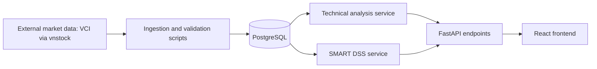
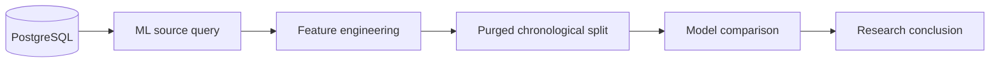

# System Architecture

The Vietnamese ETF Decision Support System uses a simple monolithic architecture. The backend exposes read-only analysis APIs and uses PostgreSQL as the main data store. The frontend consumes the APIs through typed Axios clients.

## Main Flow



## Data Processing

1. Historical OHLCV data is fetched for the supported ETFs.
2. Validation scripts check missing values, duplicate dates, invalid OHLC relationships, invalid volume, duplicate rows, and date ordering.
3. Clean historical prices are stored in `price_history`.
4. Technical indicators are calculated and stored in `technical_indicators`.
5. The DSS service loads current price and indicator data, computes raw SMART criteria, normalizes utilities across the ETF universe, applies weights, and ranks ETFs.
6. FastAPI exposes ranking, detail, comparison support data, price history, and sensitivity analysis.
7. React renders dashboard, ETF detail, comparison, and sensitivity pages.

## Backend Structure

```text
backend/app/
  api/routes/       FastAPI route handlers
  schemas/          Pydantic response models
  services/         Business logic and DSS calculations
  models/           SQLAlchemy ORM models
  db/               Database session and base configuration
  ml/               Experimental ML dataset and training utilities
  core/             Application configuration
```

The backend avoids repository classes and microservices to keep the graduation project easy to explain and maintain.

## Frontend Structure

```text
frontend/src/
  api/              Typed Axios API clients
  components/       Reusable UI and chart components
  pages/            Route-level pages
  types/            TypeScript API response interfaces
  utils/            Formatting and criterion helpers
```

## Database Tables

- `etfs`
- `price_history`
- `technical_indicators`
- `predictions`
- `recommendations`

The current final UI primarily uses `etfs`, `price_history`, and `technical_indicators`. Prediction and recommendation tables are reserved for research or future work.

## ML Experimental Branch

Machine learning is intentionally separated from the SMART production DSS path:



The ML experiment does not write predictions into the final DSS ranking and does not affect SMART scores.
